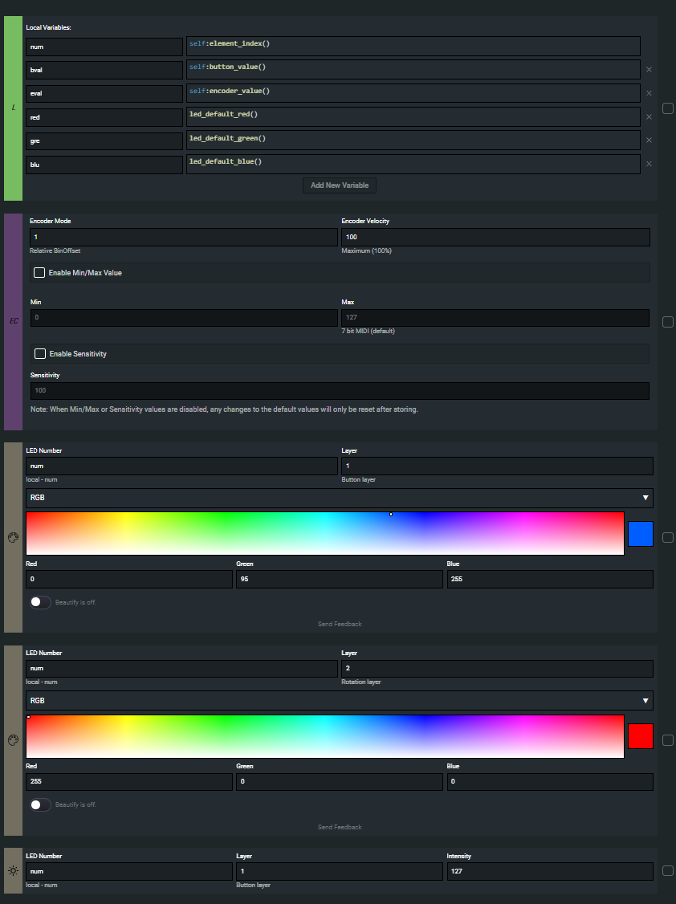
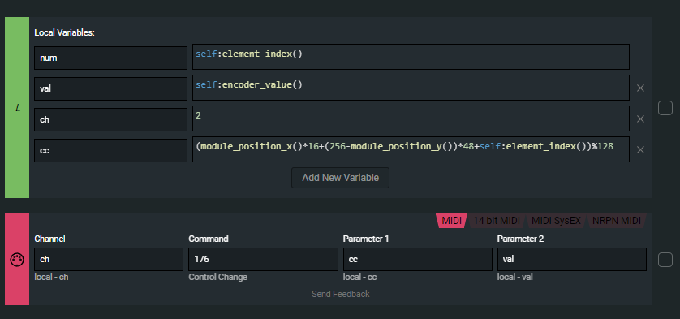

# FL Modular Grid

This is a small project made to enable infinite relative encoders on FL Studio using Intech Modular Grid devices (no more value pickup or teleportation).
It also synchronises LED's with the colors defined in the mapping configuration, for both LED layers (buttons and encoders).
It also sets intensity depending on the value of a control in fl studio.
And last, it prints the status of the CH, CC, plugin knob name and human readable value in the fl banner window.

# License

Read the license [here](`LICENSE.md`).

# FL Studio setup

Add the `device_Intech.py` as well as the `mapping.py` scripts in the fl studio midi scripting hardware controllers directory.

Important ! **Setup your intech devices with port 13** both for midi rx and tx in the fl studio midi configuration tab.

# Grid setup

Read this to configure your Intech grid correctly for the FL Studio midi script to work.

Use EN16 for positions [0, 0], [0, 1], [-1, 0]. In my configuration I have a TEK2 @ [-1, 1]
```
EN16 EN16
EN16 TEK2
```

### System - Setup

On the EN16 System `Setup` page, in the setup, declare the following variables in a `self` block

```
ci = 32+module_position_x()*16+(256-module_position_y())*48 % 128
cx = (32+module_position_x()*16+(256-module_position_y())*48 % 128)+15
lcc = -1
```

### System - Midi rx

On the `Midi rx` page, change the name of the variables (to shorten the script)

```lua
chan = midi.ch
cmd = midi.cmd
p1 = midi.p1
p2 = midi.p2
```

Then, under the `locals` block in the `Midi rx`, declare a new code block and insert the contents of the [script](grid_script.lua).

### Encoder






# Mapping

In the `mapping.py` file, there is a mapping for plugins.

Basically every plugin can be added to this mapping.

Here is a mapping example:

```python
mapping = {
    "plugins": {
        "<plugin-name>": {  # Mapping auto-syncs when a plugin with this name is focused in the FL Studio DAW
            # Sets CC 40 as an encoder with a blue led
            40: Control(encoder_led=LedColor.blue()),
            # Set CC 41 as a button with a dimmer green light
            41: Control(button_led=LedColor(r=0, g=0.7, b=0)),
            # CC 42 is used as both a button and encoder, both leds are sync depending on what's pressed
            42: Control(encoder_led=LedColor.white(), button_led=LedColor.red()),
            # CC 43 is the same as 42 but when the button is off, the red led is not dim, it's just off
            # Beautify basically "keeps the led on" even if it's "off", it's just dim
            43: Control(encoder_led=LedColor.white(), button_led=LedColor.red(), beautify_button=False),
            # CC 43 is a 3-step button, you can press it 3 times and obtain stepped midi controls
            44: Control(button_led=LedColor.yellow(), button=CtrlButton(steps=3)),
            # CC 45 is a 5-step encoder, you can turn it and it will send a higher relative value, useful for stepped potentiometers for example
            45: Control(encoder_led=LedColor.blue(), encoder=CtrlEncoder(steps=5)),
            # CC 46 is a normal encoder but the led will turn off if the value is 0
            46: Control(encoder_led=LedColor.pink(), beautify_encoder=False),

            # You can use any combo of the above values
    }
}
```

# Doc

If you are interested in how this script works, here are some additional informations.

## Midi mapping

Midi channel is always 1 for buttons, always 2 for encoders.
CC is defined depending on module position.
[0, 0] has a range of [32 -> 47]
[0, 1] has a range of [48 -> 63]
[-1, 0] has a range of [80 -> 95]

## Mini Protocol

In order to synchronize the led colors with the focused plugin, it was necessary to design a minimalistic protocol that would allow data exchange for all the knobs.

Many experiments resulted in this extremely packed protocol with only 2 message types:

1. Led intensity layer 1: midi `type=0xB0 | channel=6 | param1=7-bit cc | param2=7-bit intensity`
2. Led intensity layer 2: midi `type=0xB0 | channel=8 | param1=7-bit cc | param2=7-bit intensity`
3. Led color layer 1: midi `type=0xB0 | channel=7 | param1=7-bit color msb* | param2=7-bit color lsb*`
3. Led color layer 2: midi `type=0xB0 | channel=9 | param1=7-bit color msb* | param2=7-bit color lsb*`

*led color: for the led color, sending 3 midi messages per led layer was too expensive, to reduce it to 1, some decisions were made:
- Red: 5 bit value
- Green: 5 bit value
- Blue: 4 bit value (the human eye is less sensible to blue light than red and green, so resolution could be a bit less)

Those colors are packed in a single midi message, the cc used is the last cc received for intensity. Because it's relevant to set intensity along with color nearly every time.

This way we can send 1, at most 2 midi messages to set brightness and color of a led layer and avoid midi rx overflows on the hardware controller.
Color needs to be synced only once per plugin focus which is convenient.
